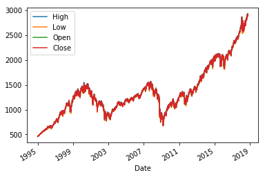
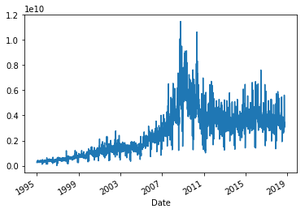
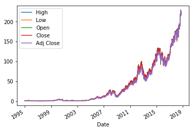
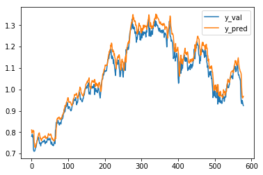
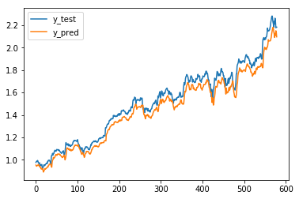

# Predicting the stock market

This blogpost aims to give a short overview of trying to predict the stock market with neural networks. At first the desired data has to be aquired. Fortunately the `pandas_datareader` library makes it easy to access the Yahoo API and make a request. The aquired data consists of the S&P500, which is an American stock market index based on the market capitalizations of 500 large companies having common stock listed on the NYSE or NASDAQ [(wiki)](https://en.wikipedia.org/wiki/S%26P_500_Index) and the Apple stock market data. The timespan ranges from the 1st January 1995 until the 30th September 2018.

Inspiration and reference from [here](https://towardsdatascience.com/neural-networks-to-predict-the-market-c4861b649371?source=email-anon_90d4caa0ccc2--publication.newsletter) and [there](https://towardsdatascience.com/neural-networks-to-predict-the-market-c4861b649371).

# Import the data


```python
import numpy as np
import pandas as pd
import matplotlib.pyplot as plt

import pandas_datareader as pdr

%matplotlib inline
```


```python
sp500_data = pdr.get_data_yahoo("^GSPC", "1995-01-01", "2018-09-30")
apple_data = pdr.get_data_yahoo("AAPL", "1995-01-01", "2018-09-30")
```

As we can see, we have 5979 datapoints and 6 Attributes in total.


```python
sp500_data.info()
```

    <class 'pandas.core.frame.DataFrame'>
    DatetimeIndex: 5979 entries, 1995-01-03 to 2018-09-28
    Data columns (total 6 columns):
    High         5979 non-null float64
    Low          5979 non-null float64
    Open         5979 non-null float64
    Close        5979 non-null float64
    Volume       5979 non-null int64
    Adj Close    5979 non-null float64
    dtypes: float64(5), int64(1)
    memory usage: 327.0 KB


The plot below shows the performance of the S&P500 over the last 13 years. Global crises (around 2008) or other recessions can be recognized easily.


```python
sp500_data[['High', 'Low', 'Open', 'Close']].plot()
```


    <matplotlib.axes._subplots.AxesSubplot at 0x1075cb898>





The volume attribute gives us "the amount (total number) of a security (or a given set of securities, or an entire market) that was traded during a given period of time." [(wiki)](https://en.wikipedia.org/wiki/Volume_(finance))


```python
sp500_data['Volume'].plot()
```


    <matplotlib.axes._subplots.AxesSubplot at 0x108d45048>





```python
apple_data.drop('Volume', axis=1).plot()
```


    <matplotlib.axes._subplots.AxesSubplot at 0x10e67f630>





```python
apple_data.head()
```


<div>
<style scoped>
    .dataframe tbody tr th:only-of-type {
        vertical-align: middle;
    }

    .dataframe tbody tr th {
        vertical-align: top;
    }

    .dataframe thead th {
        text-align: right;
    }
</style>
<table border="1" class="dataframe">
  <thead>
    <tr style="text-align: right;">
      <th></th>
      <th>High</th>
      <th>Low</th>
      <th>Open</th>
      <th>Close</th>
      <th>Volume</th>
      <th>Adj Close</th>
    </tr>
    <tr>
      <th>Date</th>
      <th></th>
      <th></th>
      <th></th>
      <th></th>
      <th></th>
      <th></th>
    </tr>
  </thead>
  <tbody>
    <tr>
      <th>1995-01-03</th>
      <td>1.388393</td>
      <td>1.352679</td>
      <td>1.388393</td>
      <td>1.370536</td>
      <td>25967200.0</td>
      <td>1.200917</td>
    </tr>
    <tr>
      <th>1995-01-04</th>
      <td>1.415179</td>
      <td>1.379464</td>
      <td>1.379464</td>
      <td>1.406250</td>
      <td>39670400.0</td>
      <td>1.232210</td>
    </tr>
    <tr>
      <th>1995-01-05</th>
      <td>1.406250</td>
      <td>1.383929</td>
      <td>1.401786</td>
      <td>1.388393</td>
      <td>18410000.0</td>
      <td>1.216563</td>
    </tr>
    <tr>
      <th>1995-01-06</th>
      <td>1.540179</td>
      <td>1.468750</td>
      <td>1.486607</td>
      <td>1.500000</td>
      <td>269155600.0</td>
      <td>1.314358</td>
    </tr>
    <tr>
      <th>1995-01-09</th>
      <td>1.495536</td>
      <td>1.464286</td>
      <td>1.486607</td>
      <td>1.471539</td>
      <td>68521600.0</td>
      <td>1.289419</td>
    </tr>
  </tbody>
</table>
</div>


## Prepare training, validation and test data

When the dataset consists of data with a time-reference, creating training and test sets from randomly sampling the data is not a good idea most of the time. Rachel Thomas talks about the specifics in detail in her [blogpost](http://www.fast.ai/2017/11/13/validation-sets/).

The following code snippet splits the data into 80% train, 10% test and 10% validation data.


```python
def train_test_val_split(data):
    #data = data[['High', 'Low', 'Open', 'Close']]
    data = data['Close']
    n_test_samples = int(len(data)*0.1)
    n_val_samples = int(len(data)*0.1)
    
    train = data[:-(n_val_samples+n_test_samples)]
    val = data[-(n_val_samples+n_test_samples):-n_test_samples]
    test = data[-n_test_samples:]
    return train, val, test
```


```python
train, val, test = train_test_val_split(apple_data)
```


```python
train = train[:,None]
val = val[:,None]
test = test[:,None]
```


```python
train.shape, val.shape, test.shape
```


    ((4785, 1), (597, 1), (597, 1))


## Scale the data

Neural networks "behave nicely" when the input data is scaled. It is important to apply the same scaling to train and test.


```python
from sklearn.preprocessing import MinMaxScaler
scaler = MinMaxScaler()
scaler.fit(train)
train = scaler.transform(train)
val = scaler.transform(val)
test = scaler.transform(test)
```


```python
train.shape, val.shape, test.shape
```


    ((4785, 1), (597, 1), (597, 1))


```python
train = np.squeeze(train)
val = np.squeeze(val)
test = np.squeeze(test)
```

## Generate dependent and independet variables regarding sequence length

Because we focus on the Closing Price of the stock or index, we only have one attribute for training and test purposes. This means, we have to create our own dependent and independet variables. The follow code snippet takes the `seq_len` attribute and creates the variables as follows:

* 10 consecutive days are put into an array, this will be the first row of `X_train`
* the day after the last day in `X_train`, so the 11th day is put into `y_train`

The creation of the variables as described above means, we want to train an algorithm by giving 10 days of stock market data and want it to predict the 11th day.


```python
def gen_data(data, seq_len):
        """
        Generates training data
        :param seq_len: length of window
        :return: X_train and Y_train
        """
        X_train, y_train = [], []
        for i in range((len(data)//seq_len)*seq_len - seq_len - 1):
            x = np.array(data[i: i + seq_len])
            y = np.array([data[i + seq_len + 1]], np.float64)
            X_train.append(x)
            y_train.append(y)
        return np.array(X_train), np.array(y_train)
```


```python
X_train, y_train = gen_data(train, 10)
X_val, y_val = gen_data(val, 10)
X_test, y_test = gen_data(test, 10)
```


```python
X_train.shape
```


    (4769, 10, 1)


## Construct neural network with Keras (MLP)

We define a neural network with Tensorflow and Keras. Keras makes it very easy to put together a neural network in a very modular way. The architecture in the code snippet below is called a [multilayer perceptron](https://en.wikipedia.org/wiki/Multilayer_perceptron) and consists of the most basic components of a neural net.


```python
import tensorflow as tf
```


```python
model = tf.keras.models.Sequential()
model.add(tf.keras.layers.Dense(50, input_dim=10, activation=tf.nn.relu))
model.add(tf.keras.layers.Dense(50, activation=tf.nn.relu))
model.add(tf.keras.layers.Dense(1, activation=tf.nn.relu))

model.compile(optimizer="adam", loss="mean_squared_error")
```


```python
model.fit(X_train, y_train, validation_data=(X_val, y_val), epochs=100, verbose=0)
```


    <tensorflow.python.keras.callbacks.History at 0x1c4be6c470>


```python
y_val_pred = model.predict(X_val)
```


```python
plt.plot(y_val)
plt.plot(y_val_pred)
plt.legend(['y_val', 'y_pred'], loc='best')
```


    <matplotlib.legend.Legend at 0x1c4bfad588>





```python
y_test_pred = model.predict(X_test)
```

As one can see, the neural net fits the curve of the test set quite well, yet it must be said that predicting only a single day makes the curve fit pretty closely anyways.


```python
plt.plot(y_test)
plt.plot(y_test_pred)
plt.legend(['y_test', 'y_pred'], loc='best')
```


    <matplotlib.legend.Legend at 0x1c4c0b3128>





I will dive into this deeper in the future.  
Following points need to be adressed:
* read more into how to properly construct dependet and independet variable in stock prediction scenarios
* change the timespans of X and y
* consider other architectures, such as LSTM or other, deeper neural networks
